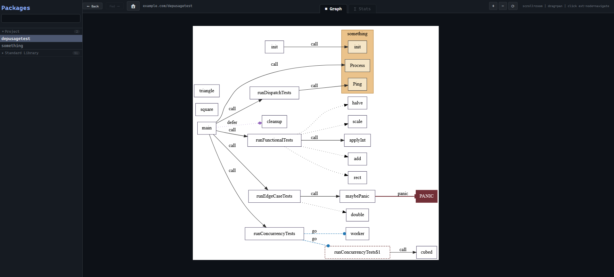
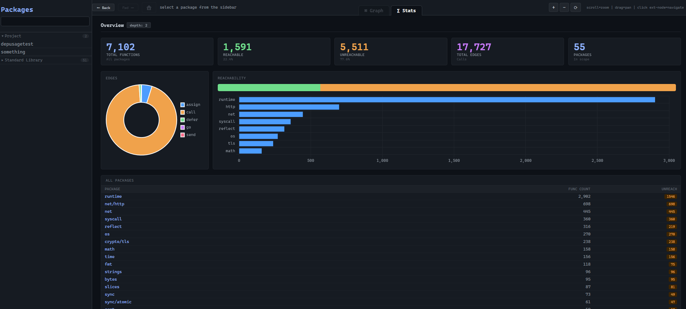

<h1 align = "center">
CallStat: Context-Sensitive Call Graph Analyzer
</h1>
<p align="center">
        
</p>
<p align="center">
        
</p>

**CallStat** is a static analysis tool designed to map and visualize function dependencies in Go projects. By leveraging Single Static Assignment (SSA) form, it captures not just direct calls, but also indirect dependencies like goroutines, deferred functions, and interface implementations.

## How it Works

The `main` function executes a specialized analysis pipeline:

1. **Project Detection**: Automatically identifies the Go module root via `go.mod` to distinguish between internal project code and external dependencies.
2. **SSA Construction**: Loads the target project using `packages.Load` and builds an SSA (Single Static Assignment) representation. This allows the tool to "see" how functions are used as values.
3. **Depth-Limited Traversal**: Calculates the "distance" of every package from your project root. You can limit analysis (e.g., to a depth of 2) to avoid drowning in standard library or deep third-party dependency graphs.
4. **Edge Extraction**: Iterates through every instruction to find:
    * **Direct Calls**: Standard function/method calls.
    * **Concurrency**: Functions started via `go` routines.
    * **Cleanup**: Functions registered via `defer`.
    * **High-Order Logic**: Functions passed as arguments, sent over channels, or returned from other functions.


5. **Reporting**: Generates a JSON file containing structural statistics and an interactive HTML report with embedded DOT/SVG visualizations.

## Usage Example

To analyze a project, point the tool to the target directory. You can use the `--skip-vis` flag to hide noisy internal packages (like `runtime`) from the final graph.

```bash
# Analyze the test benchmark project
go run . \
  -dir="../dep-usage-test/" \
  -depth=2 \
  -skip-vis="runtime/" \
  -skip-vis="sync" \
  -skip-vis="go/types" \
  -svg-dir="./output/svg" \
  -dot-dir="./output/dot"

```

### CLI Flags

| Flag | Default | Description |
| --- | --- | --- |
| `-dir` | `../dep-usage-test/` | The path to the Go project you want to analyze. |
| `-depth` | `2` | How many "hops" away from the root module to scan (-1 for unlimited). |
| `-no-stdlib` | `false` | If true, completely ignores the Go standard library. |
| `-skip-vis` | (empty) | Repeatable. Hides specific packages from the visual graph (e.g. `runtime/`). |
| `-report` | `./report.html` | The path where the final interactive HTML report is saved. |

## Development & Benchmarking

The project includes a `dep-usage-test` directory. This is a dedicated benchmark suite containing complex Go patterns (generics, interfaces, channel-passed functions) used to verify the accuracy of the call graph extraction logic.